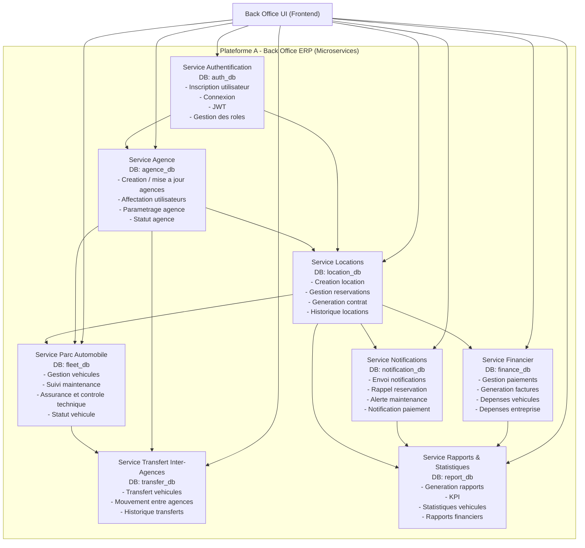

<p align="center">
  
</p>

# ERP Car Rental - Back Office

Back-office ERP pour la gestion d'un reseau d'agences de location de voitures.
Le projet suit une architecture microservices pour separer les domaines metier et faciliter l'evolution de la plateforme.

## 1) Vision du projet

Ce projet couvre la gestion complete d'une plateforme de location:

- authentification et roles utilisateurs
- gestion multi-agences
- gestion flotte (vehicules, maintenance, assurance)
- gestion locations et contrats
- suivi financier (paiements, factures, depenses)
- transferts inter-agences
- notifications operationnelles
- rapports et KPI

## 2) Architecture microservices (diagramme)

Le diagramme ci-dessous est base sur votre architecture, avec ajout du `Service Agence`.



## 3) Description des services

| Service | Role principal | Base de donnees |
| --- | --- | --- |
| Authentification | Login, register, JWT, roles/permissions | `auth_db` |
| Agence | Gestion des agences et affectation organisationnelle | `agence_db` |
| Locations | Cycle location: reservation, contrat, historique | `location_db` |
| Parc Automobile | Gestion flotte, maintenance, assurance, statut | `fleet_db` |
| Financier | Paiements, facturation, depenses | `finance_db` |
| Notifications | Alertes metier et rappels automatiques | `notification_db` |
| Transfert Inter-Agences | Deplacement vehicules entre agences | `transfer_db` |
| Rapports & Statistiques | Tableaux de bord, KPI, reportings | `report_db` |

## 4) Structure du repository (kola dossier chno fih)

```text
car-rental-erp-backoffice/
|- .github/
|  `- workflows/
|     `- auth-ci.yml
|- Cahier de charge/
|  |- cahier de charge.pdf
|  `- logo.png
|- Conception/
|  |- Architecture de projet/
|  |- Diagramme de classe/
|  `- MCD & MLD/
|- Docs/
|- code/
|  |- Backend_Server/
|  |  |- Auth-service/
|  |  |- Agence-service/        (dossier reserve au microservice agence)
|  |  `- docker-compose.yml
|  `- Frontend/
|     |- src/
|     |- public/
|     `- package.json
`- README.md
```

### Detail rapide par dossier

- `.github/workflows/`: pipeline CI pour tester et builder `Auth-service`.
- `Cahier de charge/`: besoin metier, scope fonctionnel, assets (logo).
- `Conception/`: diagrammes d'architecture, modeles de donnees (MCD/MLD), diagrammes UML/PlantUML.
- `Docs/`: livrables de sprint et documentation projet.
- `code/Backend_Server/`: backend microservices (auth implementee, agence preparee).
- `code/Frontend/`: interface Back Office React (Vite).

## 5) Etat actuel du projet

- `Auth-service`: implemente (API + tests + Docker + CI).
- `Agence-service`: dossier present pour implementation prochaine.
- autres microservices: definis dans la conception et architecture cible.

## 6) Demarrage rapide

### Backend (Auth service + PostgreSQL + pgAdmin)

```bash
cd code/Backend_Server
docker compose up --build
```

Services exposes:

- API Auth: `http://localhost:8000`
- Swagger: `http://localhost:8000/docs`
- pgAdmin: `http://localhost:5050`

### Frontend (React + Vite)

```bash
cd code/Frontend
npm install
npm run dev
```

Frontend: `http://localhost:5173`

## 7) CI/CD

Workflow principal actuel: `.github/workflows/auth-ci.yml`

Il execute:

- tests `pytest` du service auth
- build Docker de `Auth-service`
