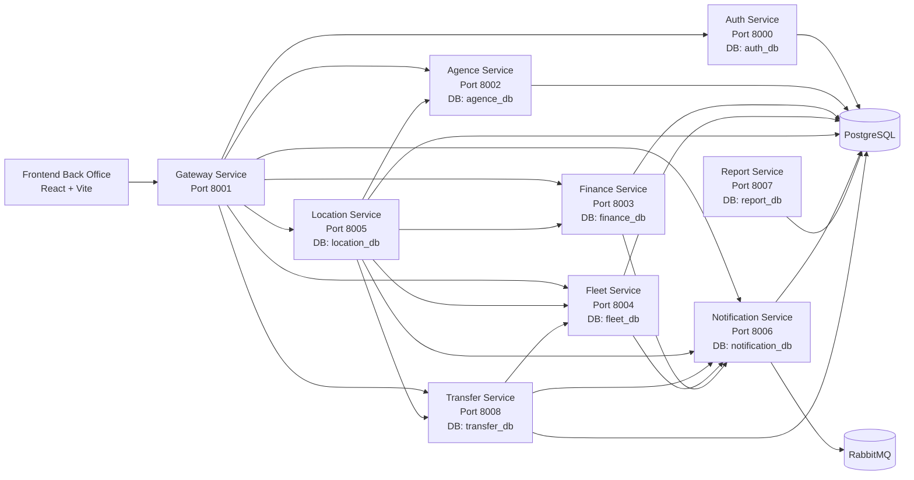

<p align="center">
  
</p>

# ERP Car Rental - Back Office

Back-office ERP pour la gestion complete d'un reseau d'agences de location de voitures.
Le projet est base sur une architecture microservices pour separer les domaines metier, faciliter la maintenance, et permettre l'evolution du systeme service par service.

## 1) C'est quoi ce systeme ?

Ce systeme permet de piloter toute l'activite d'une entreprise de location de voitures depuis une interface Back Office:

- gestion des utilisateurs et des droits d'acces
- gestion des agences
- gestion du parc automobile (vehicules, entretiens, assurances)
- gestion des locations (contrats, retours, prolongations)
- gestion financiere (factures, paiements, charges, comptes)
- gestion des transferts inter-agences
- gestion des notifications operationnelles
- suivi des KPI et reporting

## 2) Vue globale de l'architecture



## 3) Comment les services communiquent entre eux

Il y a 2 modes de communication:

1. Synchrone (HTTP REST)
- le Frontend passe par le `Gateway-service`
- certains microservices appellent directement d'autres microservices (ex: `location-service` appelle `fleet-service`, `finance-service`, `transfer-service`, `agence-service`, `notification-service`)

2. Asynchrone (messaging)
- `notification_service` dispose d'un worker (`notification_worker`) et de RabbitMQ pour traiter des evenements en arriere-plan

### Flux metier principal (exemple creation location)

1. utilisateur cree une location via Frontend
2. Frontend appelle Gateway
3. Gateway route vers `location-service`
4. `location-service` verifie vehicule et disponibilite via `fleet-service`
5. `location-service` verifie contraintes de transfert via `transfer-service`
6. `location-service` cree la location
7. `location-service` tente de creer la facture via `finance-service`
8. `location-service` envoie un evenement vers `notification-service`

## 4) Services backend (detail complet)

| Service | Port | Responsabilites principales | Base de donnees |
| --- | --- | --- | --- |
| Auth Service | `8000` | login, register, JWT, gestion users, roles et scopes | `auth_db` |
| Gateway Service | `8001` | point d'entree unique API, proxy vers microservices, gestion erreurs `502` | - |
| Agence Service | `8002` | CRUD agences, activation/desactivation, soft delete/restore | `agence_db` |
| Finance Service | `8003` | factures, paiements, charges, comptes de tresorerie, rapport financier | `finance_db` |
| Fleet Service | `8004` | gestion vehicules, entretiens, assurances, marques/modeles/categories | `fleet_db` |
| Location Service | `8005` | cycle complet location, contrat PDF, retour avec penalite, stats | `location_db` |
| Notification Service | `8006` | creation d'evenements, inbox, unread count, marquage lu, email/popup | `notification_db` |
| Report Service | `8007` | generation rapports, dashboard, export PDF/Excel | `report_db` |
| Transfer Service | `8008` | transferts entre agences, workflow statut, sync vehicule | `transfer_db` |

### 4.1 Auth Service

Fonctions:
- authentification JWT
- gestion des utilisateurs
- controle des roles (`super_admin`, `admin`, `employe`)
- controle du scope agence pour `admin` et `employe`

Regles metier importantes:
- un seul `super_admin` actif
- `admin` gere uniquement les `employe` de sa propre agence
- `super_admin` gere `admin` et `employe` sur toutes les agences

### 4.2 Gateway Service

Fonctions:
- unifier les appels API depuis le Frontend
- proxifier vers les services cibles (`/api/auth`, `/api/agences`, `/api/fleet`, etc.)
- retourner des erreurs claires quand un service interne est indisponible

### 4.3 Agence Service

Fonctions:
- creer, modifier, lister les agences
- activer/desactiver une agence
- suppression logique (`soft delete`) + restauration

Regle d'acces:
- lecture possible pour utilisateur connecte
- ecriture reservee au `super_admin`

### 4.4 Finance Service

Fonctions:
- factures (`/api/factures`)
- paiements (`/api/paiements`)
- charges (`/api/charges`)
- comptes de tresorerie (`/api/comptes`)
- rapport global (`/api/rapport`)

Specificites:
- soft delete sur plusieurs entites
- calcul automatique montant TTC
- mise a jour automatique statut facture selon paiements

### 4.5 Fleet Service

Fonctions:
- gestion des vehicules
- gestion des entretiens
- gestion des assurances
- gestion du referentiel marques/modeles/categories
- notification d'evenements metier vers notification-service

### 4.6 Location Service

Fonctions:
- creer / lire / modifier / supprimer location
- changer statut (`en_cours`, `terminee`, `annulee`)
- retour vehicule avec calcul de penalite
- prolongation d'une location
- generation contrat PDF
- stats (total, en cours, terminees, annulees, revenu)

Integrations:
- validation vehicule via Fleet
- creation facture via Finance
- verification transfert via Transfer
- notifications via Notification

### 4.7 Notification Service

Fonctions:
- recevoir des evenements (`/notifications/events`)
- inbox notifications (`/notifications/inbox`)
- compteur non lues (`/notifications/unread-count`)
- marquer une notification lue ou tout marquer lu
- envoi email et popup selon canaux demandes

Scope:
- `super_admin` voit tout
- `admin`/`employe` voient scope `all` + scope agence correspondante

### 4.8 Report Service

Fonctions:
- consulter rapports
- stats globales
- dashboard
- generation de rapport
- export PDF et Excel

Remarque:
- le service expose actuellement ses routes sans guard JWT explicite dans les routes.

### 4.9 Transfer Service

Fonctions:
- creer un transfert de vehicule
- lister disponibilites de transfert
- workflow de statut (`PENDING`, `IN_TRANSIT`, `COMPLETED`, `CANCELLED`)
- annuler / supprimer selon droits
- synchroniser vehicule cote Fleet selon statut transfert
- emettre des notifications metier

## 5) Roles utilisateurs et droits d'acces

Roles globaux du systeme:

- `super_admin`: role global, acces total multi-agences
- `admin`: gestion de son agence et operations managers
- `employe`: operations quotidiennes, scope limite a son agence

### Matrice d'acces simplifiee

| Domaine | super_admin | admin | employe |
| --- | --- | --- | --- |
| Utilisateurs (Auth) | lecture/ecriture globale (`admin` + `employe`) | gestion `employe` de sa propre agence | profil personnel |
| Agences | lecture + ecriture | lecture | lecture |
| Fleet - vehicules | full | creation/update sur scope autorise | lecture |
| Fleet - entretien/assurance | full | full sur scope autorise | operations sur scope autorise |
| Fleet - marques/modeles/categories | full | lecture | lecture |
| Locations | full | CRUD selon scope + retour/prolongation | creation/update/statut selon scope (pas suppression admin-level) |
| Finance - factures/paiements/charges | full | operations metier | operations metier selon routes autorisees |
| Finance - comptes tresorerie | full | lecture | lecture |
| Transfers | full | gestion workflow source agence | creation/lecture scope agence + limitations workflow |
| Notifications | full | inbox agence | inbox agence |
| Reporting | acces technique ouvert (a securiser) | acces technique ouvert (a securiser) | acces technique ouvert (a securiser) |

## 6) Endpoints Gateway utilises par le Frontend

Base API Frontend:

```text
http://localhost:8001/api
```

Routes principales:

- `/auth/*` -> Auth Service
- `/utilisateurs/*` -> Auth Service (users)
- `/agences/*` -> Agence Service
- `/finance/*` -> Finance Service
- `/fleet/*` -> Fleet Service
- `/location/*` -> Location Service
- `/transfer/*` -> Transfer Service
- `/notifications/*` -> Notification Service

## 7) Structure du repository

```text
car-rental-erp-backoffice/
|- .github/
|  `- workflows/
|     |- auth-ci.yml
|     `- gateway-ci.yml
|- cahier de charge/
|  |- cahier de charge.pdf
|  `- logo.png
|- Conception/
|  |- Architecture de projet/
|  |- Diagramme de classe/
|  `- MCD & MLD/
|- Docs/
|- code/
|  |- docker-compose.yml
|  |- docker/
|  `- Backend_Server/
|     |- Auth-service/
|     |- Gateway-service/
|     |- Agence-service/
|     |- Finance-service/
|     |- fleet-service/
|     |- location-service/
|     |- notification_service/
|     |- Report-service/
|     `- transfer-service/
|  `- Frontend/
|     |- src/
|     |  `- images/logo.png
|     |- public/
|     `- package.json
`- README.md
```

## 8) Demarrage rapide (recommande)

### 8.1 Lancer toute la plateforme (Docker Compose)

```bash
cd code
docker compose up --build
```

Services exposes:

- Auth Service: `http://localhost:8000`
- Gateway Service: `http://localhost:8001`
- Agence Service: `http://localhost:8002`
- Finance Service: `http://localhost:8003`
- Fleet Service: `http://localhost:8004`
- Location Service: `http://localhost:8005`
- Notification Service: `http://localhost:8006`
- Report Service: `http://localhost:8007`
- Transfer Service: `http://localhost:8008`
- Frontend: `http://localhost:5173`
- PostgreSQL: `localhost:5432`
- pgAdmin: `http://localhost:5050`
- RabbitMQ UI: `http://localhost:15672`

### 8.2 Lancer seulement le Frontend en local

```bash
cd code/Frontend
npm install
npm run dev
```

## 9) Variables d'environnement importantes

Variables partagees par les services (selon besoins):

- `SECRET_KEY`
- `ALGORITHM`
- `DATABASE_URL`
- URLs internes inter-services (`*_SERVICE_URL`)

Important:
- garder le meme `SECRET_KEY`/`ALGORITHM` entre services qui verifient le JWT
- en Docker, utiliser les noms de services (`auth_service`, `fleet_service`, etc.)

## 10) Documentation API

- Swagger Auth: `http://localhost:8000/docs`
- Swagger Finance: `http://localhost:8003/docs`
- Swagger Fleet: `http://localhost:8004/docs`
- Swagger Location: `http://localhost:8005/docs`
- Swagger Notification: `http://localhost:8006/docs`
- Swagger Report: `http://localhost:8007/docs`
- Swagger Transfer: `http://localhost:8008/docs`

## 11) Etat actuel du projet

- architecture microservices complete presente dans le repository
- communication principale via Gateway + appels inter-services metier
- gestion des roles deja integree dans les services critiques
- notifications centralisees (API + worker)
- CI existante (auth et gateway)

## 12) Resume metier

Ce systeme ERP permet a une entreprise de location de voitures de centraliser toute son activite back-office avec:

- securite (JWT + roles)
- controle par agence
- operations flotte/location/finance/transfert
- notifications et tracabilite
- reporting et export

C'est une base solide pour une plateforme multi-agences evolutive.

